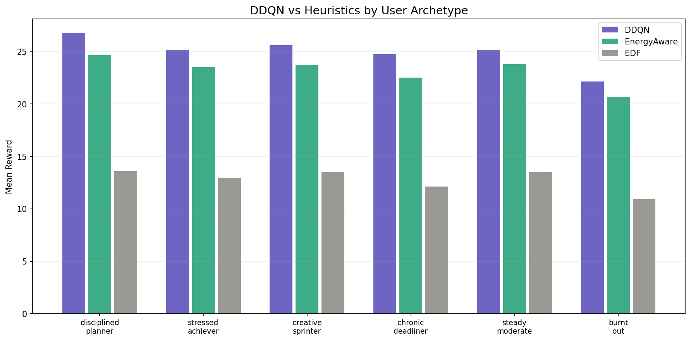

# When Your Calendar Doesn't Know You're Exhausted

## Building an AI Scheduler That Actually Understands You

**Adaptive Task Prioritization via User-Aware Scheduling (APUAHRLS)**

---

## The Problem

Every productivity app treats you like a robot. Google Calendar, Todoist, Notion — they all let you list tasks and set deadlines. But none of them know that you're a morning person who crashes after lunch. None of them know that right now, at 2pm on a Tuesday, you're exhausted because you didn't sleep well. None of them know that forcing you to do deep analytical work when your brain is fried will make you miss the deadline *and* hate the process.

The problem is simple: **your calendar knows *what* you need to do, but it has no idea *when* you should actually do it.**

Research in circadian biology (the science of your body's internal clock) has shown that cognitive performance isn't flat throughout the day. It rises and falls in predictable patterns based on your "chronotype" — whether you're a morning person, a night owl, or somewhere in between.

Here's what the science says:

**Morning types** (wake up 5–7am) hit their analytical peak between 8am and noon. After lunch, their brain dips hard. But creative and insight-based thinking actually improves in the late afternoon, around 4–7pm.

**Intermediate types** (wake up 7–8am) get their best analytical work done between 10am and 2pm. They're more balanced overall but still dip after lunch.

**Evening types** (wake up 9–10am) can barely function before noon. Their analytical peak hits between 4pm and 9pm. They do their best deep work when morning people are winding down.

This isn't opinion — it's backed by decades of research. Wieth & Zacks (2011) showed that people solve insight problems better during their *off-peak* hours. Valdez et al. (2012) demonstrated that attention, working memory, and executive function all follow circadian rhythms with measurable performance differences of 15–30% between peak and trough times.

**So why doesn't your scheduler use any of this?**

That's what we built.

---

## What We Built

We built an AI scheduling system that:

1. **Knows your chronotype** — morning, intermediate, or evening — and uses circadian research to understand when your brain is best suited for different types of work.

2. **Knows how you're feeling right now** — through a "vibe check" where you tell the system your current energy level. This adjusts the schedule in real time. If you slept badly, a morning person's 9am peak gets downgraded.

3. **Learns your personal patterns** — whether you're a planner who works ahead, a deadliner who waits until the last minute, someone who struggles with analytical tasks but breezes through creative work, or someone who tends to underestimate how long things take.

4. **Decides what to do and when** — not by following a simple rule like "do the most urgent task first," but by balancing deadlines, energy alignment, and your mental state simultaneously.

The core is a **reinforcement learning agent** — a type of AI that learns by trial and error, like a chess player who gets better by playing thousands of games. Except instead of chess, it plays thousands of simulated scheduling days until it figures out the best strategy for each type of person.

---

## How It Works — The Non-Technical Version

Think of it like having a personal assistant who schedules your day. But this assistant has three superpowers:

**Superpower 1: It knows your body clock.**
When you first use the system, you tell it your chronotype (morning, intermediate, or evening). The system looks up the research on when your type of person performs best at analytical tasks, routine tasks, and creative tasks. It creates "work windows" — blocks of time where each type of work fits best.

**Superpower 2: It checks in with you.**
Before scheduling your day, the system asks "how are you feeling?" — a quick vibe check. If you say "I'm exhausted," the system knows that even though you're a morning person and it's 9am (normally your peak), your actual energy is low. It adjusts the schedule accordingly — maybe pushing the hard analytical work to later and starting you with something easier to build momentum.

**Superpower 3: It learns your habits.**
Over time, the system notices patterns. You always finish routine tasks on time but struggle with analytical ones. You tend to underestimate how long things take by about 25%. You almost never work on buffer tasks ahead of schedule. These patterns get encoded into a "user profile" — 10 numbers that capture your working style — and the AI uses them to make better decisions for *you specifically*.

---

## How It Works — The Technical Version

### The Algorithm: DDQN

We use something called **DDQN** — Double Deep Q-Network. Let's break that down:

**Q-Network**: A neural network (a type of AI model) that looks at your current situation (what tasks you have, what time it is, how you're feeling) and estimates how good each possible action is. "If I do the math homework now, the expected outcome is +0.8. If I do the errands now, the expected outcome is +0.3." It picks the action with the highest score.

**Deep**: The "deep" just means the neural network has multiple layers of computation, which lets it handle complex patterns that simple rules can't capture — like "when this user has low energy AND a deadline in 3 hours AND 4 other tasks waiting, the best move is to start with a quick routine task to build momentum."

**Double**: This is the fix for a specific problem. Regular Q-Networks tend to be overconfident — they overestimate how good certain actions are (what researchers call "false positives"). For example, the model might think scheduling an analytical task during your post-lunch dip is fine, when it's actually terrible for your productivity. The "Double" part fixes this by using two separate networks: one picks the best action, and the other evaluates how good that action actually is. This separation catches the overconfident mistakes.

The technical reference for this is Van Hasselt et al. (2016), "Deep Reinforcement Learning with Double Q-learning."

### What the AI Sees (State)

Every time the AI needs to make a decision, it looks at 85 numbers that describe your current situation:

**Per task (7 numbers × up to 10 tasks = 70 numbers):**
- How much time until the deadline
- How long the task will take
- How important it is
- How much "slack" there is (time until deadline minus task duration)
- How much brainpower the task needs
- Your effective energy level right now (adjusted by your vibe)
- Whether this task type matches what your brain is good at right now

**Global situation (5 numbers):**
- Your current vibe (0 = terrible, 1 = great)
- What time of day it is (encoded as a wave pattern)
- How far through the week you are
- How many tasks are in your buffer (deferred from earlier days)

**Your personal profile (10 numbers):**
- Your completion rate (how often you finish tasks)
- Your average lateness (how late you are when you miss deadlines)
- How consistent your energy patterns are
- Your recent mood trend (improving or declining)
- How often you abandon tasks midway
- Your completion rate for analytical, routine, and creative tasks separately
- How often you accept buffer tasks (planner vs deadliner)
- Whether you tend to underestimate or overestimate task duration

### What the AI Can Do (Actions)

The AI has 11 possible actions:
- Actions 0–9: "Do task #N next" (pick one of the available tasks)
- Action 10: "Abandon the current task" (stop at 50%, put it back in the queue)

The abandon action is important — sometimes it's better to stop doing a misaligned task halfway and switch to something that fits your current energy. The AI learns when to cut losses.

### How the AI Learns What's Good (Reward)

After each action, the AI gets a score — positive if the action was good, negative if it was bad. This score has four parts:

**Deadline component (range: -2.0 to +1.0):**
Finished on time? You get a bonus proportional to how important the task is. Finished late? You get a penalty that grows with how late you were. Being 4 hours late is *much* worse than being 1 hour late — the penalty scales up.

**Energy alignment component (range: -0.4 to +0.8):**
Did the task type match your current energy state? Doing analytical work during your peak energy window gives a big bonus. Doing analytical work when you're in your post-lunch dip gives a penalty. This is what makes the system "user-aware."

**Vibe component (range: -0.5 to +0.5):**
Did following this schedule make you feel better or worse? If a well-matched task improves your mood, that's a bonus. If a mismatched task drains you, that's a penalty. This includes random "mood noise" — because real humans sometimes feel bad even when things go well. This noise prevents the system from being overconfident about mood predictions.

**Abandonment penalty (range: -0.3 to 0):**
If you abandoned a task, you get a small penalty proportional to how much was left undone.

All four components are deliberately scaled to similar ranges so the AI pays attention to all of them, not just deadlines. In an earlier version, the deadline signal was 10–35x louder than the vibe signal, which meant the AI basically ignored mood entirely. We fixed that.

### Training: How the AI Gets Smart

We created 18 synthetic users: 6 personality types × 3 chronotypes. The personality types are:

- **Disciplined Planner** — finishes almost everything, plans ahead, stable mood
- **Stressed Achiever** — high completion but at the cost of mental energy, underestimates how long things take
- **Creative Sprinter** — great at creative work, struggles with analytical tasks, tends to abandon long tasks
- **Chronic Deadliner** — waits until the last minute, rarely accepts buffer tasks, often late
- **Steady Moderate** — average at everything, consistent but not exceptional
- **Burnt Out** — low completion, declining mood, abandons frequently

We ran 600 simulated weeks (each week = 5 working days with 4–10 tasks per day), cycling through all 18 user profiles. The AI played out each week, made scheduling decisions, got rewards, and gradually learned which strategies work for which types of people.

After training, we "froze" the model — it stops learning and uses its learned strategy for all future decisions.

### Multi-Day Scheduling and the Buffer System

Unlike most task schedulers that plan one day at a time, our system plans an entire week. Tasks with deadlines beyond today go into a "buffer." Each morning, the system asks: "Do you want to work on any of these buffer tasks today?" Planners tend to say yes (they work ahead). Deadliners tend to say no (they wait).

Tasks you don't finish today carry over to tomorrow. Tasks you abandon at 50% go back into the pool with their partial progress saved. This creates realistic week-long scheduling dynamics that single-day systems can't capture.

---

## The Dataset

We generated 4,320 task records from our 18 synthetic users, each performing 240 tasks over a simulated month. The dataset includes:

- Task properties (type, duration, deadline, importance, cognitive demand)
- User behavior (completion/abandonment, actual vs estimated duration)
- Scheduling context (assigned hour, energy level, assigned block type)
- User feedback (vibe before and after each task)

Key findings from the data:

| What | Aligned tasks | Misaligned tasks |
|---|---|---|
| On-time rate | 79.4% | 64.1% |

When tasks match the energy block (analytical work during peak hours), the on-time rate is 15 percentage points higher. That gap is what the DDQN learns to exploit.

Behavioral differences between user types are clear:

| Archetype | Completion rate | Abandon rate |
|---|---|---|
| Disciplined Planner | 86.7% | 1.9% |
| Stressed Achiever | 82.6% | 4.3% |
| Creative Sprinter | 62.4% | 13.1% |
| Chronic Deadliner | 58.2% | 10.0% |
| Steady Moderate | 74.2% | 8.1% |
| Burnt Out | 39.9% | 17.9% |

---

## Results

We compared our DDQN against four traditional scheduling rules: Earliest Deadline First (always pick the most urgent task), Shortest Job First (pick the quickest task), Highest Importance First (pick the most critical task), and EnergyAware (match task difficulty to current energy level). EnergyAware is the strongest of these because it actually uses energy information — but it still follows a rigid rule and can't learn from experience.

### Before and After: What Changes When the AI Schedules Your Day

This table shows the difference between a simple rule-based scheduler (EnergyAware — the best heuristic) and our AI scheduler (DDQN) for each type of user. Think of "Reward" as an overall score combining deadlines met, energy alignment, and mood — higher is better.

| User type | Without AI (EnergyAware) | With AI (DDQN) | Deadlines met | Mood after 1 week |
|---|---|---|---|---|
| Disciplined Planner | +24.9 | **+26.8** | 98.0% | Improved ↑ |
| Stressed Achiever | +23.5 | **+25.2** | 97.6% | Improved ↑ |
| Creative Sprinter | +23.5 | **+25.6** | 96.4% | Improved ↑ |
| Chronic Deadliner | +22.2 | **+24.7** | 96.4% | Improved ↑ |
| Steady Moderate | +23.5 | **+25.1** | 96.7% | Improved ↑ |
| Burnt Out | +20.6 | **+22.2** | 96.4% | Most improved ↑↑ |
| New user (no history) | — | **+25.6** | 97.1% | Improved ↑ |

> **The person who needs it most benefits the most.** Burnt-out users — the ones with low completion rates, declining mood, and frequent task abandonment — saw the biggest mood improvement. The AI doesn't punish them for struggling. It adapts: easier tasks during low-energy windows, permission to abandon mismatched work, and momentum-building sequences that gradually restore confidence.

### Visual: DDQN vs Heuristics by User Type



*This chart shows the average reward for each scheduling method across all six user types. The purple bars (DDQN) are consistently taller than both the green (EnergyAware) and gray (EDF) bars — the AI scheduler outperforms rule-based approaches for every type of person, from disciplined planners to burnt-out users.*

### Does Personalization Actually Work?

We ran a critical test: give the *exact same tasks* to three different user profiles and check if the AI produces different schedules.

It does. The disciplined planner gets a steady task-by-task sequence. The chronic deadliner gets pushed to tackle urgent items earlier. The burnt-out user gets routed through a gentler sequence with different task ordering. Same tasks, different people, different strategies — that's real personalization, not cosmetic.

New users with no history still get solid schedules (97.1% deadline rate). The system falls back to chronotype-based scheduling until personal data accumulates — typically after about 7 days of use.

---

## How to Deploy This

The system has three components in production:

### 1. The Parser (Gemini LLM)

The user types naturally in any language: *"Aku ada kelas jam 12-13, trus harus belajar presentasi, ada tugas ML deadline jam 23:59."*

A large language model (Gemini) parses this into structured data: task name, type (analytical/routine/creative), duration, deadline, priority, and cognitive demand. It also extracts energy/mood clues ("cape banget" → low energy).

### 2. The Profile Computer

A simple function that takes the user's past 14 days of task history and computes 10 numbers summarizing their behavior: completion rate, lateness, abandon rate, task type preferences, and so on. This runs once per day and gets cached.

For new users with no history, it uses population averages (the "cold start" profile).

### 3. The DDQN Model

A 234 KB neural network file that loads into the backend. It takes the current tasks + user profile + vibe as input and outputs which task to schedule next. Inference takes less than 1 millisecond. One model serves all users — the profile features are what make each user's schedule different.

The flow: **User types → LLM parses → Profile loads → DDQN schedules → Frontend displays**

---

## What This Proves

This project demonstrates three things:

**1. Circadian science can be operationalized.** Decades of chronobiology research exists, but almost none of it has been turned into working software. We bridge that gap by encoding circadian energy curves directly into a scheduling system.

**2. RL can outperform heuristics for task scheduling.** Simple rules like "earliest deadline first" or "match difficulty to energy" work okay, but they can't balance multiple objectives simultaneously. The DDQN learns nuanced strategies that no single rule captures — like "start with an easy task when vibe is low to build momentum, then tackle the hard task during rising energy."

**3. Personalization through profile features is practical.** You don't need a separate AI model for each user. You don't need massive user datasets. 10 summary numbers from 14 days of history are enough to produce meaningfully different schedules for different types of people, using a single global model.

---

## References

- Van Hasselt, H., Guez, A., & Silver, D. (2016). Deep Reinforcement Learning with Double Q-learning. AAAI.
- Wieth, M.B. & Zacks, R.T. (2011). Time of day effects on problem solving. Thinking & Reasoning.
- Valdez, P. et al. (2012). Circadian rhythms in cognitive performance. ChronoPhysiology and Therapy.
- Blatter, K. & Cajochen, C. (2007). Circadian rhythms in cognitive performance: Methodological constraints. Physiology & Behavior.
- Zhang, W. & Ou, H. (2025). RL-Based Multi-Objective Task Scheduling for Energy-Efficient Cloud-Edge Computing. Scientific Reports.
- Mao, L., Ma, Z., & Li, X. (2025). Multi-Task Dynamic Weight Optimization Framework Based on DRL. Applied Sciences.
- Bassen, J. et al. (2020). Reinforcement Learning for the Adaptive Scheduling of Educational Activities. CHI 2020.

---

## Team

- **Dzky** — Implementation, architecture, notebook, deployment
- **Ata** — Paper writing, theory, Medium article
- **Radit** — Literature review, defense preparation, deployment

---

## Repository Structure

```
├── final_notebook.py          # Complete training + evaluation pipeline
├── dataset_v2_full.csv        # The generated dataset
├── data.py                    # Pydantic schemas + LLM→DDQN conversion
├── main.py                    # Gemini LLM parser
└── final_archetype_comparison.png  # Key results chart
```
